# Mayasari Bakery Analysis

A portfolio-grade **Business Intelligence and Data Analytics case study** for analyzing bakery sales, customers, products, profitability, customer value, and business growth opportunities.

The project transforms transactional bakery data into validated analytical datasets, business insights, dashboards, and an executive management presentation.

---

## Executive Summary

Mayasari Bakery generated:

| KPI               |    Result |
| ----------------- | --------: |
| Revenue           | Rp 761.8M |
| Gross Profit      | Rp 334.3M |
| Gross Margin      |    43.88% |
| Operating Expense | Rp 167.5M |
| Operating Profit  | Rp 166.8M |
| Operating Margin  |    21.89% |
| Customers         |       850 |
| Products          |        28 |

The analysis indicates a profitable business with meaningful opportunities in:

* Revenue momentum management
* Product-mix optimization
* Customer retention
* Customer value development
* Margin protection
* Targeted customer reactivation

The project is designed as a complete analytics workflow rather than a collection of isolated analyses. Analytical outputs are reconciled through data contracts and regression tests to maintain consistency across dashboards, insights, and management artifacts.

---

# 1. Project Objective

The objective is to demonstrate how transactional business data can be transformed into **decision-ready business intelligence**.

The analytical workflow covers:

1. Data acquisition
2. Dataset inspection
3. Data validation
4. Data preparation
5. Transaction-level analysis
6. Time-series analysis
7. Product analysis
8. Customer analysis
9. Customer segmentation
10. Customer Lifetime Value analysis
11. Customer opportunity analysis
12. Profitability analysis
13. Business Intelligence artifact generation
14. Dashboard development
15. Executive insight generation
16. Management presentation

The project emphasizes:

* Reproducibility
* Analytical consistency
* Explicit data contracts
* Data-path contracts
* Cross-artifact reconciliation
* Business interpretation
* Decision-oriented reporting

---

# 2. Business Questions

## Revenue

* How is revenue changing over time?
* Which months generate the strongest revenue?
* Which periods show significant growth or decline?
* What is the overall revenue trend?
* What factors should management investigate behind revenue momentum?

## Products

* Which products generate the most revenue?
* Which products contribute the most gross profit?
* Which products have the strongest margins?
* Which products have weaker margins?
* How concentrated is revenue across the product portfolio?

## Customers

* How many customers contribute to the business?
* Which customers generate the highest revenue?
* Which customers contribute the highest historical CLV?
* How is customer value distributed?
* How concentrated is customer value?

## Customer Value

* Which customers have the highest annualized CLV?
* What proportion of customer value comes from high-value tiers?
* Which behavioral and economic variables are associated with customer value?
* Which customers should receive retention or development attention?

## Customer Opportunities

* Which customers should be protected?
* Which customers require rescue or reactivation?
* Which customers have development potential?
* Which customers should be monitored?
* How should management prioritize customer interventions?

## Profitability

* What is the gross margin?
* What is the operating margin?
* Which products have stronger or weaker margins?
* How does revenue translate into gross profit?
* Where can profitability be protected or improved?

---

# 3. Analytical Results

## Revenue Performance

The strongest monthly revenue occurred in **2025-12**:

**Rp 77.9M**

The strongest month-over-month growth also occurred in **2025-12**:

**26.45%**

The weakest monthly revenue occurred in **2025-02**:

**Rp 57.1M**

The weakest month-over-month performance occurred in **2025-10**:

**-7.86%**

These movements indicate that revenue performance is not uniform throughout the year.

Management should investigate the commercial and operational factors behind high-growth and weak periods, including:

* Campaign timing
* Product availability
* Seasonal demand
* Customer activation
* Inventory planning
* Product mix

---

## Sales Performance Analysis

The sales-performance layer provides a reproducible monthly analysis built from the validated data/processed/monthly_kpi.parquet dataset.

### Annual Sales Performance

| KPI | Result |
| --- | ---: |
| Gross Sales | Rp 790.6M |
| Discount | Rp 28.8M |
| Net Sales | Rp 761.8M |
| Transactions | 13,000 |
| Units Sold | 38,602 |
| Product Cost | Rp 427.5M |
| Gross Profit | Rp 334.3M |
| Gross Margin | 43.88% |
| Operating Expense | Rp 167.5M |
| Operating Profit | Rp 166.8M |
| Operating Margin | 21.89% |
| Average Transaction Value | Rp 58,600 |

### First-to-Last Month Movement

The first-to-last observed-month comparison shows:

| Metric | Movement |
| --- | ---: |
| Net Sales | +30.97% |
| Transactions | +18.65% |
| Units Sold | +20.51% |
| Gross Profit | +30.39% |
| Average Transaction Value | +10.39% |

Net sales therefore increased faster than transaction volume across the observed period, while average transaction value also increased.

### Strongest and Weakest Months

**December 2025** was the strongest observed month across the primary sales metrics:

- Net sales: **Rp 77.9M**
- Transactions: **1,209**
- Units sold: **3,696**
- Gross profit: **Rp 33.9M**
- Average transaction value: **Rp 64,449**

The lowest net sales month was **February 2025**, at approximately **Rp 57.1M**.

These findings are descriptive. They identify observed performance patterns but do not establish causal explanations such as seasonality, campaign effects, product availability, or changes in customer behavior.

### Reproducible Sales Analysis

The sales-performance analysis is implemented as reusable Python business logic plus executable reporting scripts.

Key implementation files:

- src/sales_performance.py
- scripts/analyze_sales_performance.py
- scripts/generate_sales_performance_report.py
- reports/sales_performance.md

Generate the CLI analysis with:

    python scripts/analyze_sales_performance.py

Generate the Markdown report with:

    python scripts/generate_sales_performance_report.py

---

## Sales Performance Visualizations

The sales-performance layer is supported by six reproducible visualizations generated directly from `data/processed/monthly_kpi.parquet`.

### Monthly Net Sales

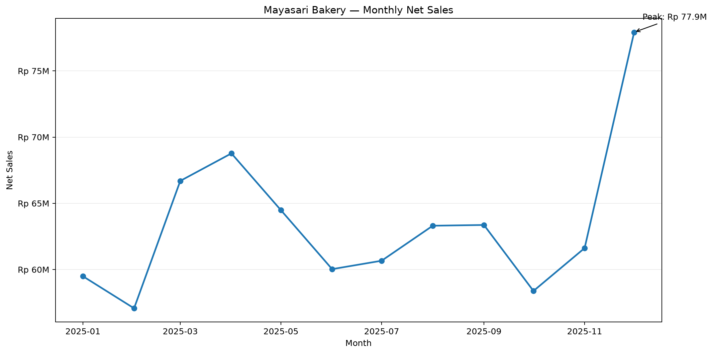

### Monthly Transactions

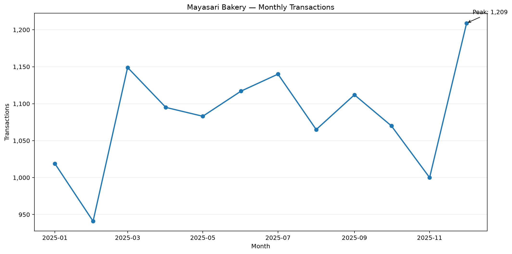

### Monthly Units Sold

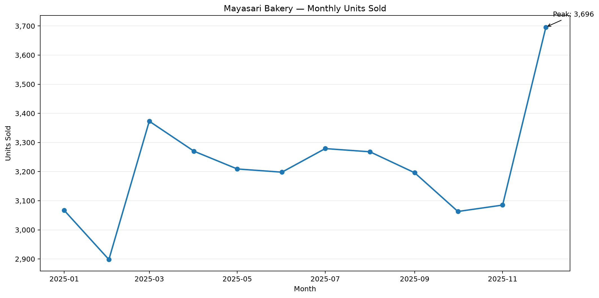

### Monthly Gross Profit

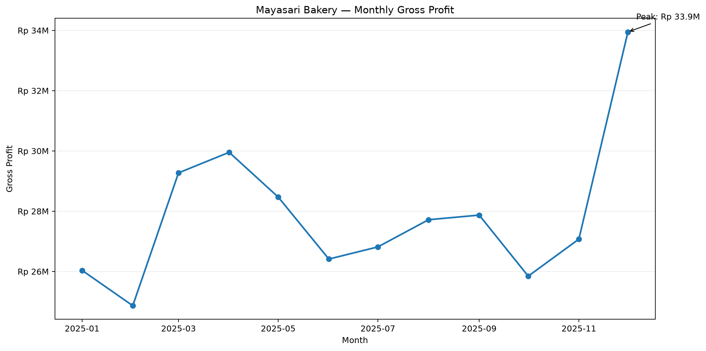

### Average Transaction Value

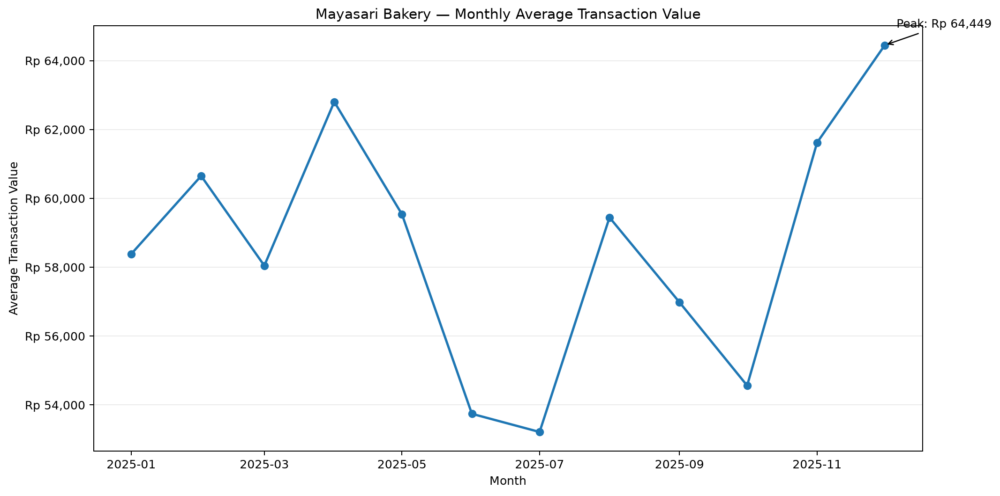

### Sales Performance Overview

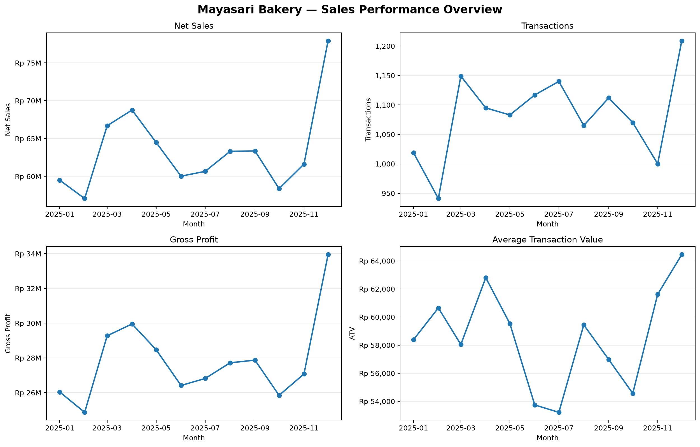

The visualization generator is available at `scripts/generate_sales_visualizations.py` and can be rerun whenever the validated monthly KPI dataset changes.

---

## Customer Performance Visualizations

The customer-performance layer is supported by six reproducible visualizations generated from the validated customer analytics datasets in `data/analytics/`.

### Annualized Customer Lifetime Value Distribution

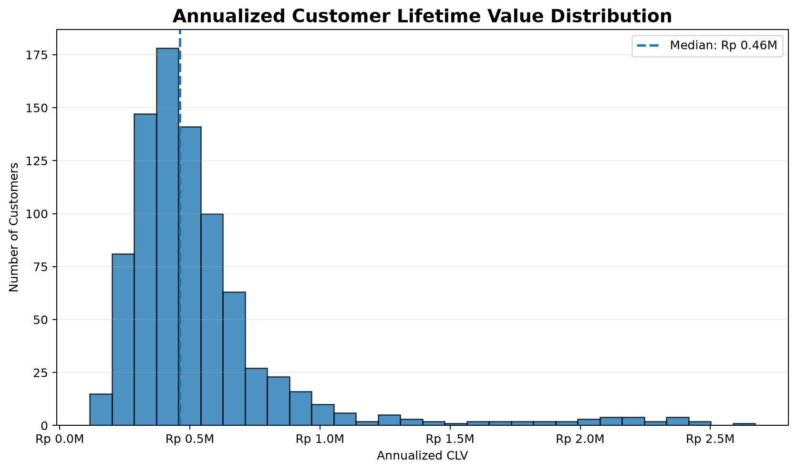

### Customer Segment Performance

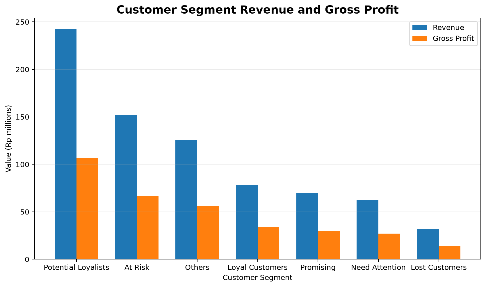

### Customer Value Tier Performance

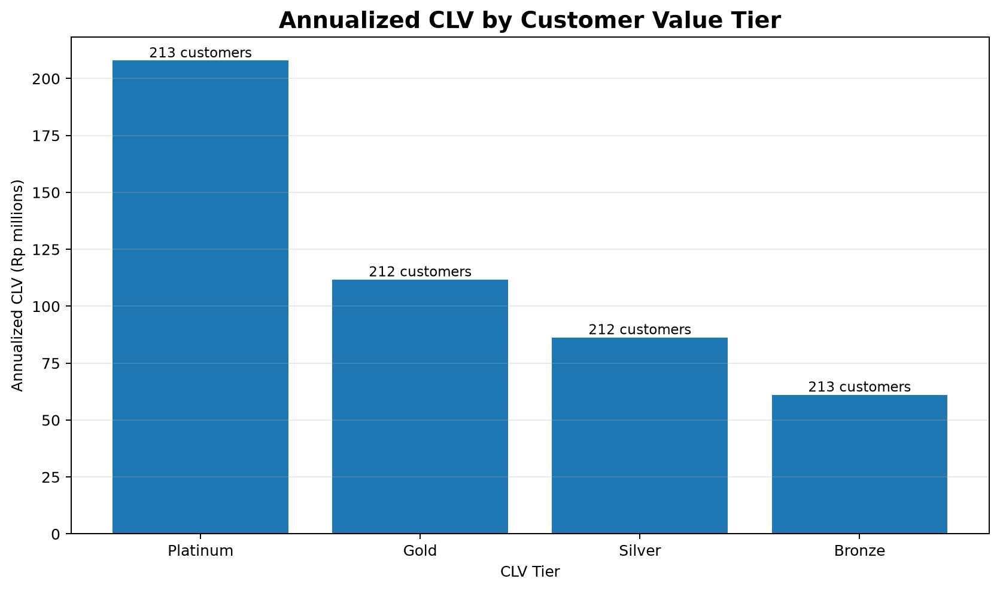

### Customer Opportunity Analysis

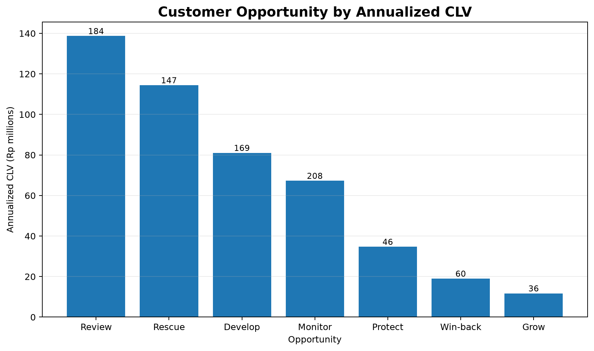

### Customer RFM Distribution

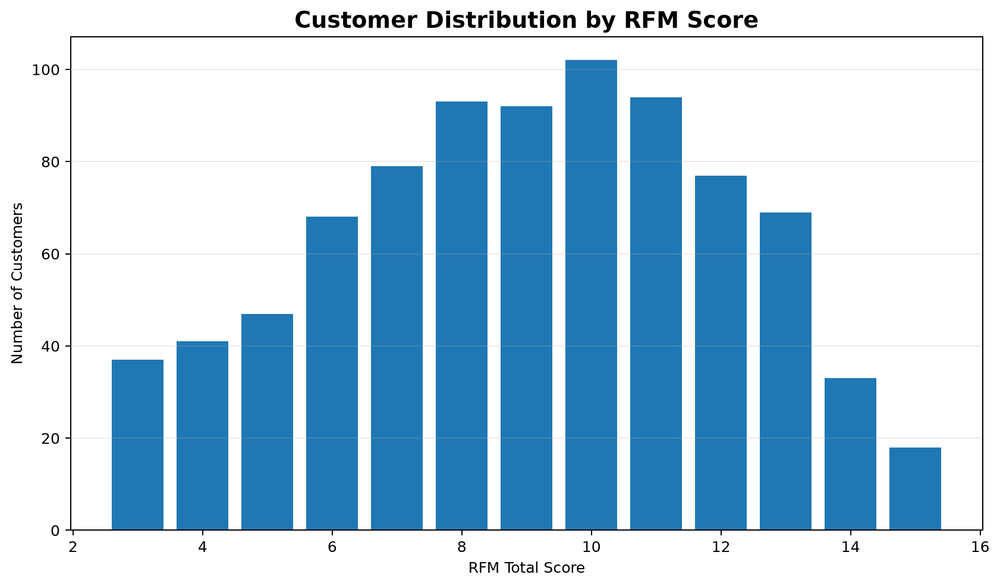

### Customer Performance Overview

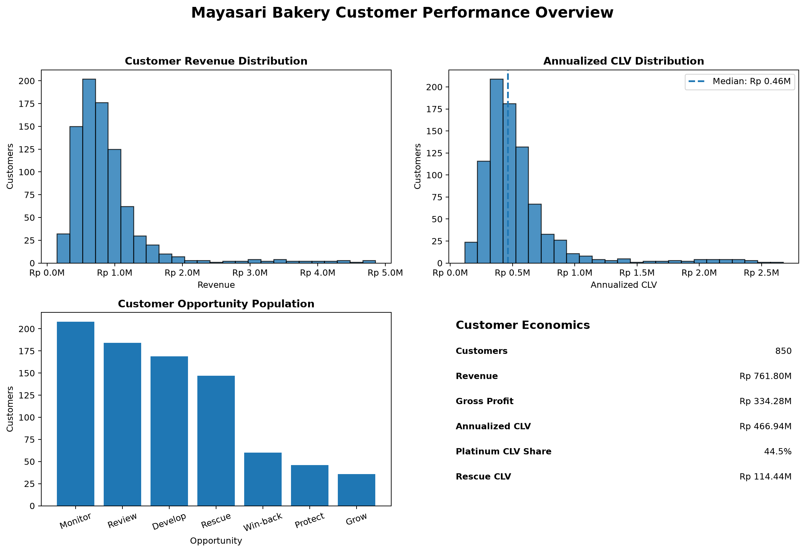

The visualization generator is available at `scripts/generate_customer_visualizations.py` and can be rerun whenever the validated customer analytics datasets change.

---

## Product Performance

The product portfolio contains:

**28 products**

The top 10 products contribute approximately:

**60.98% of total product revenue**

The leading revenue-generating product is:

**Birthday Cake (P018)**

with approximately:

**Rp 104.2M revenue**

The highest gross-margin product is:

**Kue Sus — 50.47%**

The lowest gross-margin product is:

**Paket Hampers Mini — 38.97%**

This creates a product-mix opportunity.

High-revenue products should remain operational priorities, while higher-margin products can be evaluated for:

* Bundling
* Cross-selling
* Promotional placement
* Increased visibility
* Product-mix optimization

---

## Customer Portfolio

The analysis contains:

**850 customers**

Total customer revenue:

**Rp 761,804,925**

Total historical customer gross profit:

**Rp 334,282,225**

Average historical customer revenue:

**Rp 896.2K**

Average historical CLV:

**Rp 393.3K**

The highest-revenue customer is:

**C0560 — Rp 4.9M**

The top 10 customers contribute approximately:

**5.85% of total customer revenue**

The customer portfolio is relatively broad, although high-value customers remain important for retention and relationship management.

---

# 4. Customer Lifetime Value

Historical CLV represents realized historical customer gross-profit contribution in the current analytical model.

Therefore:

```text
Historical CLV = Customer Gross Profit
```

Annualized CLV is a normalized customer-value indicator and should **not** be interpreted as realized historical gross profit.

### CLV Summary

| Metric                 |          Value |
| ---------------------- | -------------: |
| Total Historical CLV   | Rp 334,282,225 |
| Total Annualized CLV   | Rp 466,943,654 |
| Average Historical CLV |     Rp 393,273 |
| Average Annualized CLV |     Rp 549,345 |
| Median Annualized CLV  |     Rp 461,554 |
| Customers              |            850 |

### Annualized CLV Distribution

| Statistic |        Value |
| --------- | -----------: |
| Minimum   |   Rp 115,114 |
| Q1        |   Rp 355,833 |
| Median    |   Rp 461,554 |
| Q3        |   Rp 599,938 |
| Maximum   | Rp 2,672,143 |

The distribution indicates meaningful variation in normalized customer value.

The difference between median and maximum CLV should be monitored because a relatively small group of high-value customers can contribute disproportionately to the overall customer-value portfolio.

---

## CLV Tier Performance

Customers are classified into relative annualized CLV tiers:

* **Platinum** — top 25%
* **Gold** — 25–50%
* **Silver** — 50–75%
* **Bronze** — bottom 25%

| Tier     | Customers | Customer Share |   Revenue | Revenue Share | Gross Profit | GP Share | Annualized CLV | CLV Share |
| -------- | --------: | -------------: | --------: | ------------: | -----------: | -------: | -------------: | --------: |
| Bronze   |       213 |          25.1% |  Rp 97.1M |         12.7% |     Rp 43.5M |    13.0% |       Rp 61.1M |     13.1% |
| Silver   |       212 |          24.9% | Rp 140.9M |         18.5% |     Rp 62.8M |    18.8% |       Rp 86.3M |     18.5% |
| Gold     |       212 |          24.9% | Rp 184.7M |         24.2% |     Rp 81.7M |    24.4% |      Rp 111.7M |     23.9% |
| Platinum |       213 |          25.1% | Rp 339.2M |         44.5% |    Rp 146.3M |    43.8% |      Rp 207.9M |     44.5% |

Platinum customers represent approximately **44.5% of total annualized CLV** despite representing only approximately one quarter of the customer base.

This makes Platinum customers an important retention priority.

Gold customers represent the next-largest value pool and provide a potential development segment.

---

## High-Value Customers

Several customer metrics identify different dimensions of customer value:

| Metric                 | Customer |       Result |
| ---------------------- | -------- | -----------: |
| Highest Annualized CLV | C0346    | Rp 2,672,143 |
| Highest Historical CLV | C0531    | Rp 2,000,425 |
| Highest Revenue        | C0560    | Rp 4,851,300 |
| Highest Gross Margin % | C0066    |       47.93% |

These customers should not be treated as interchangeable because revenue, gross profit, margin, and annualized customer value measure different aspects of customer economics.

---

## CLV Concentration

The top 10 customers by annualized CLV account for approximately:

**5.13% of total annualized CLV**

The top 25% of customers account for approximately:

**44.52% of total annualized CLV**

The same customers selected by annualized CLV ranking contribute:

* **4.71%** of total historical CLV for the top 10
* **43.75%** of total historical CLV for the top 25%

Annualized CLV concentration provides a normalized customer-value perspective, while historical CLV concentration provides a realized profitability perspective.

---

## Customer Value Drivers

The following variables were evaluated for association with annualized CLV:

| Driver                    | Correlation | Relationship       |
| ------------------------- | ----------: | ------------------ |
| Average Transaction Value |       0.947 | Strong positive    |
| Revenue                   |       0.943 | Strong positive    |
| Historical CLV            |       0.941 | Strong positive    |
| Gross Margin %            |      -0.463 | Moderate negative  |
| Transactions              |       0.123 | Very weak positive |
| Active Months             |      -0.043 | Very weak negative |
| Observed Lifetime Days    |      -0.019 | Very weak negative |

Average transaction value shows the strongest observed association with annualized CLV at approximately **0.95**.

Correlation measures association, not causation. Therefore, this relationship should be validated through behavioral and commercial analysis before being translated into a specific business intervention.

---

# 5. Customer Opportunity Analysis

The customer opportunity framework combines customer economics, CLV, and RFM behavior to create management-oriented decision-support groups.

## Opportunity Portfolio

| Opportunity | Customers | Customer Share |   Revenue | Revenue Share | Annualized CLV | CLV Share |
| ----------- | --------: | -------------: | --------: | ------------: | -------------: | --------: |
| Protect     |        46 |          5.41% |  Rp 65.0M |         8.54% |       Rp 34.7M |     7.44% |
| Rescue      |       147 |         17.29% | Rp 182.8M |        23.99% |      Rp 114.4M |    24.51% |
| Review      |       184 |         21.65% | Rp 226.9M |        29.78% |      Rp 138.7M |    29.70% |
| Develop     |       169 |         19.88% | Rp 137.6M |        18.07% |       Rp 81.1M |    17.36% |
| Grow        |        36 |          4.24% |  Rp 21.5M |         2.82% |       Rp 11.7M |     2.51% |
| Monitor     |       208 |         24.47% | Rp 102.8M |        13.49% |       Rp 67.3M |    14.41% |
| Win-back    |        60 |          7.06% |  Rp 25.2M |         3.31% |       Rp 19.0M |     4.07% |

### Key Portfolio Insight

**Review** is the largest value pool by annualized CLV, contributing approximately **29.70%** of total annualized CLV.

**Rescue** represents another significant economic pool, contributing approximately **24.51%** of annualized CLV.

Together, **Protect, Rescue, and Review** cover 377 customers and represent approximately:

* **62.31% of revenue**
* **61.65% of annualized CLV**

This makes these three groups particularly important for management prioritization.

---

## Opportunity Interpretation

### Protect

Protect customers are economically important relationships where retention is a priority.

Potential actions include:

* Personalized engagement
* Repeat-purchase reminders
* Priority service
* Relevant product recommendations
* Early access to selected products

### Rescue

Rescue customers warrant targeted recovery actions because their current economic contribution justifies additional attention.

The objective is to identify the reason for reduced activity and determine whether reactivation is commercially viable.

### Review

Review customers require additional diagnostic attention.

Management should evaluate:

* Recent purchasing behavior
* Customer value
* Transaction frequency
* Product mix
* Margin contribution

before selecting an intervention.

### Develop

Develop customers represent potential opportunities to increase customer value through:

* Increased purchase frequency
* Basket expansion
* Cross-selling
* Product breadth
* Repeat-purchase programs

### Grow

Grow customers can receive measured development initiatives without disproportionate resource allocation.

### Monitor

Monitor customers should remain under lightweight observation.

Management attention can increase when behavioral or economic signals change.

### Win-back

Win-back customers represent lapsed relationships.

Reactivation campaigns should be evaluated against expected recovery economics before significant investment is made.

---

# 6. Profitability Analysis

Mayasari Bakery generated:

| Metric            |     Value |
| ----------------- | --------: |
| Revenue           | Rp 761.8M |
| Gross Profit      | Rp 334.3M |
| Gross Margin      |    43.88% |
| Operating Expense | Rp 167.5M |
| Operating Profit  | Rp 166.8M |
| Operating Margin  |    21.89% |

The positive operating margin indicates that gross profit is currently sufficient to cover the operating expense structure.

Management should therefore evaluate revenue growth and profitability together.

Revenue growth that reduces margin quality may not create proportional improvement in operating profit.

---

## Margin Opportunities

Product margins vary meaningfully across the portfolio.

The highest gross-margin product identified in the analysis is:

**Kue Sus — 50.47%**

The lowest gross-margin product is:

**Paket Hampers Mini — 38.97%**

This margin gap creates opportunities to:

* Review product pricing
* Review product costs
* Improve product mix
* Promote higher-margin products
* Evaluate bundle economics
* Monitor discounting

Margin optimization should be performed without compromising customer demand or strategic product positioning.

---

# 7. Business Intelligence Architecture

The project follows a layered analytical architecture:

```text
Raw Transaction Data
        │
        ▼
Data Inspection
        │
        ▼
Data Validation
        │
        ▼
Processed Analytical Data
        │
        ▼
Business Analytics
        │
        ├── Revenue / Time Series
        ├── Product Analysis
        ├── Customer Analysis
        ├── Segmentation
        ├── CLV
        ├── Opportunity Analysis
        └── Profitability
        │
        ▼
Analytics Data Contracts
        │
        ▼
Dashboards + Insights
        │
        ▼
Executive Management Presentation
```

The architecture separates data preparation, analytical computation, business interpretation, and presentation artifacts.

---

# 8. Project Structure

```text
mayasari-bakery-analysis/
│
├── data/
│   ├── raw/
│   │   └── mayasari_bakery_2025_synthetic.xlsx
│   │
│   ├── processed/
│   │   ├── customers.parquet
│   │   ├── expenses.parquet
│   │   ├── monthly_kpi.parquet
│   │   ├── products.parquet
│   │   └── sales.parquet
│   │
│   └── analytics/
│       ├── customer_opportunity.parquet
│       ├── customer_performance.parquet
│       ├── executive_kpis.parquet
│       ├── monthly_performance.parquet
│       ├── product_performance.parquet
│       └── profitability_summary.parquet
│
├── dashboard/
│   └── app.py
│
├── notebooks/
│
├── reports/
│   ├── figures/
│   │   ├── customers/
│   │   ├── executive/
│   │   ├── products/
│   │   ├── profitability/
│   │   └── sales/
│   │
│   ├── insights/
│   │   ├── clv_insights.md
│   │   ├── customer_opportunity_insights.md
│   │   └── executive_insights.md
│   │
│   └── presentation/
│       ├── mayasari_bakery_management_deck.pptx
│       └── rendered/
│           └── mayasari_bakery_management_deck.pdf
│
├── src/
│   ├── contracts/
│   │   ├── __init__.py
│   │   └── paths.py
│   │
│   ├── business_intelligence.py
│   ├── clv_insights.py
│   ├── customer_analysis.py
│   ├── customer_dashboard.py
│   ├── customer_lifetime_value.py
│   ├── customer_opportunity_analysis.py
│   ├── customer_opportunity_insights.py
│   ├── customer_profitability_analysis.py
│   ├── customer_retention_analysis.py
│   ├── customer_segmentation_analysis.py
│   ├── executive_insights.py
│   ├── executive_kpi_analysis.py
│   ├── executive_presentation.py
│   ├── inspect_dataset.py
│   ├── prepare_dataset.py
│   ├── product_analysis.py
│   ├── product_dashboard.py
│   ├── product_profitability_analysis.py
│   ├── profile_dataset.py
│   ├── profitability_analysis.py
│   ├── profitability_dashboard.py
│   ├── revenue_dashboard.py
│   ├── sales_overview.py
│   ├── time_series_analysis.py
│   ├── trend_seasonality_analysis.py
│   ├── validate_dataset.py
│   └── visualization.py
│
├── tests/
│   ├── contracts/
│   │   ├── test_bi_schema.py
│   │   ├── test_cross_artifact_reconciliation.py
│   │   ├── test_dashboard_sources.py
│   │   ├── test_opportunity_dependency.py
│   │   └── test_transaction_grain.py
│   │
│   ├── test_analytics_imports.py
│   └── test_paths_contract.py
│
├── .gitignore
├── README.md
└── requirements.txt
```

---

# 9. Analytical Artifacts

The project produces several analytical layers.

## Processed Data

Processed datasets provide cleaned and standardized analytical inputs:

* Customers
* Products
* Sales
* Expenses
* Monthly KPI

## Analytics Data

Analytics datasets provide business-level outputs:

* Customer performance
* Customer opportunity
* Executive KPIs
* Monthly performance
* Product performance
* Profitability summary

These artifacts provide stable sources for dashboards, reports, and executive analysis.

---

# 10. Dashboards

The project includes dashboard artifacts for:

### Revenue

Revenue and monthly performance analysis.

### Products

Product performance and product profitability analysis.

### Customers

Customer portfolio and customer-level performance analysis.

### Profitability

Revenue, gross profit, margin, operating expense, and operating profit analysis.

### Executive

High-level management KPIs and business performance overview.

Dashboard figures are stored under:

```text
reports/figures/
```

---

# 11. Executive Management Presentation

The project includes an executive management presentation generated from the analytical outputs.

Files:

```text
reports/presentation/mayasari_bakery_management_deck.pptx
reports/presentation/rendered/mayasari_bakery_management_deck.pdf
```

The presentation summarizes:

* Business performance
* Revenue trends
* Customer economics
* Product performance
* Profitability
* Customer opportunities
* Management priorities

The presentation is designed to communicate analytical findings to a non-technical management audience.

---

# 12. Data Contracts and Reconciliation

The project uses explicit analytical contracts to reduce inconsistency between analytical artifacts.

The contract layer currently covers:

* Repository data paths
* Analytics artifact locations
* Business intelligence schemas
* Transaction grain
* Dashboard data sources
* Customer opportunity dependencies
* Cross-artifact reconciliation

Regression tests are used to detect structural or analytical inconsistencies.

This is important because the project contains multiple downstream artifacts derived from the same business data.

---

# 13. Testing

The project includes automated tests covering:

* Analytics module imports
* Repository paths
* Transaction grain
* Business intelligence schema contracts
* Dashboard data sources
* Customer opportunity dependencies
* Cross-artifact reconciliation

Run the complete test suite with:

```bash
pytest -q
```

A successful run should report all tests passing.

---

# 14. Python Environment

The project uses a Python virtual environment.

Activate it with:

```bash
source .venv/bin/activate
```

Install project dependencies with:

```bash
pip install -r requirements.txt
```

The project requirements include the primary analytical stack:

* pandas
* numpy
* matplotlib
* seaborn
* openpyxl
* JupyterLab
* pytest-related development tooling used by the project

---

# 15. Reproducible Analytical Workflow

A typical analytical workflow is:

```text
1. Activate environment
        ↓
2. Inspect raw dataset
        ↓
3. Validate dataset
        ↓
4. Prepare processed datasets
        ↓
5. Generate analytical datasets
        ↓
6. Generate dashboards / figures
        ↓
7. Generate business insights
        ↓
8. Generate executive presentation
        ↓
9. Run regression tests
        ↓
10. Review artifacts
        ↓
11. Commit and push
```

The exact execution order should follow the dependency structure of the analytical modules and data contracts.

---

# 16. Key Management Insights

## Revenue Momentum

The strongest monthly revenue and month-over-month growth occurred in December 2025.

Management should identify whether the performance was driven by:

* Seasonal demand
* Promotional campaigns
* Product availability
* Customer activation
* Higher transaction value
* Product mix

The objective is to determine which drivers can be reproduced rather than simply assuming that the December result will repeat automatically.

## Product Mix

Birthday Cake is the leading revenue-generating product.

At the same time, Kue Sus has a stronger gross margin.

This suggests an opportunity to manage the portfolio using both:

* Revenue contribution
* Profitability contribution

rather than ranking products by revenue alone.

## Customer Value

Platinum customers represent approximately 44.5% of annualized CLV.

This creates a strong economic case for differentiated retention strategies.

Gold customers also represent a meaningful value pool and may be candidates for development initiatives.

## Customer Opportunities

Review, Rescue, and Protect represent the most economically significant opportunity groups when considering revenue and annualized CLV together.

Management should prioritize these groups according to:

1. Economic value
2. Behavioral signals
3. Feasibility of intervention
4. Expected commercial return

## Profitability

The business currently produces positive operating profit.

The next improvement stage should therefore focus on converting the existing revenue base into stronger and more predictable profitability.

---

# 17. Management Recommendations

### Priority 1 — Protect High-Value Customers

Prioritize Platinum and other economically significant customers for retention initiatives.

Possible actions:

* Personalized offers
* Repeat-purchase reminders
* Priority service
* Product recommendations
* Seasonal early access

### Priority 2 — Rescue Valuable At-Risk Customers

Use CLV and RFM information to identify customers where recovery effort is economically justified.

### Churn Risk Screening

The M19 churn-risk analysis adds a recall-first screening layer to the customer retention framework.

At the retained threshold of **0.25**, the Random Forest model captures **100.00% of observed churners**, but classifies **96.67% of the evaluated population as high-risk**.

Key results:

* Evaluated population: **120 customer-cutoff records**
* Observed churners: **31**
* High-risk customers: **116**
* False positives: **85**
* Recall: **100.00%**
* Precision: **26.72%**

The model should therefore be used as a **broad screening signal**, followed by secondary business filtering using customer value, intervention cost, engagement history, recency/frequency, and campaign capacity.

Detailed findings are available in [`reports/m19_9_github_summary.md`](reports/m19_9_github_summary.md).

### Priority 3 — Develop Gold and Development Customers

Increase customer value through:

* Basket expansion
* Cross-selling
* Product breadth
* Purchase-frequency initiatives
* Targeted promotions

### Priority 4 — Optimize Product Mix

Maintain strong availability for leading products while increasing the contribution of products with attractive margins.

### Priority 5 — Protect Margin

Monitor:

* Product costs
* Pricing
* Discounts
* Product mix
* Operating expenses

Revenue growth should be evaluated together with gross-profit and operating-profit impact.

### Priority 6 — Investigate Revenue Momentum

Study the operational and commercial drivers behind strong periods, particularly December 2025, and determine which drivers can be replicated.

---

# 18. Analytical Limitations

This project is a portfolio-oriented analytical case study using a synthetic bakery dataset.

Therefore, findings should be interpreted as analytical demonstrations rather than audited financial statements or forecasts of an actual operating bakery.

Important limitations include:

* The dataset is synthetic.
* Historical CLV represents realized historical gross-profit contribution under the project's analytical definition.
* Annualized CLV is a normalized customer-value indicator.
* Opportunity classifications are decision-support labels, not causal predictions.
* Correlations describe association and should not be interpreted as causation.
* Customer behavior is observed only within the available dataset period.
* Revenue and profitability conclusions depend on the assumptions encoded in the analytical model.

Business decisions would require validation against actual operational, financial, pricing, inventory, and customer data.

---

# 19. Portfolio Value

This project demonstrates capabilities across several areas of modern data analytics:

### Data Analytics

* Data inspection
* Data validation
* Data preparation
* Exploratory analysis
* Statistical analysis

### Business Intelligence

* KPI modeling
* Analytical data marts
* Dashboard development
* Cross-artifact reconciliation
* Management reporting

### Customer Analytics

* Customer segmentation
* RFM analysis
* Customer Lifetime Value
* Customer profitability
* Customer opportunity classification

### Product Analytics

* Product revenue
* Product profitability
* Product margin analysis
* Product-mix analysis

### Engineering Practices

* Modular Python architecture
* Explicit data contracts
* Repository path contracts
* Regression testing
* Reproducible workflows
* Artifact validation

### Business Communication

* Executive insights
* Management recommendations
* Presentation development
* Decision-oriented storytelling

---

# 20. Project Status

The core analytical and Business Intelligence workflow is complete.

Completed components include:

* Data preparation
* Analytical datasets
* Revenue analysis
* Product analysis
* Customer analysis
* Customer segmentation
* Customer Lifetime Value
* Customer opportunity analysis
* Profitability analysis
* Business Intelligence layer
* Dashboards
* Executive insights
* Executive management presentation
* Analytical contracts
* Regression tests

The current milestone is focused on final project documentation and portfolio presentation quality.

---

# 21. Repository Artifacts

Key project artifacts include:

```text
reports/insights/
├── clv_insights.md
├── customer_opportunity_insights.md
└── executive_insights.md

reports/
├── m19_9_business_findings_report.md
└── m19_9_github_summary.md

reports/presentation/
├── mayasari_bakery_management_deck.pptx
└── rendered/
    └── mayasari_bakery_management_deck.pdf

data/analytics/
├── customer_opportunity.parquet
├── customer_performance.parquet
├── executive_kpis.parquet
├── monthly_performance.parquet
├── product_performance.parquet
└── profitability_summary.parquet
```

---

# 22. Final Takeaway

Mayasari Bakery demonstrates a healthy operating structure with:

**43.88% gross margin**

and:

**21.89% operating margin**

The most important improvement opportunities are not limited to increasing revenue.

The analysis points toward four interconnected management priorities:

1. **Protect valuable customers**
2. **Develop customer value**
3. **Optimize product mix**
4. **Protect profitability**

The combination of customer analytics, product analytics, revenue analysis, and profitability analysis provides a more complete decision framework than any single KPI.

The project therefore demonstrates how transactional data can be transformed into a reproducible Business Intelligence workflow that supports both operational analysis and executive decision-making.

---

## Author

**StudioNomad**

Portfolio project — Mayasari Bakery Business Intelligence & Data Analytics Case Study.
